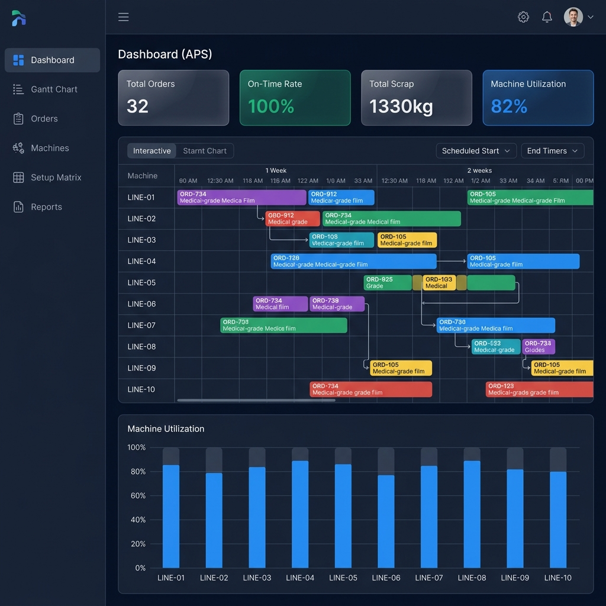

# 医疗 PE 薄膜吹膜机 APS 智能排程系统



本项目是一个专门针对**医疗级包装材料（如输液袋膜、无菌器械透气膜等）**的多层共挤吹膜机组研发的 **Advanced Planning and Scheduling (APS)** 高级计划与排程系统。

系统核心基于 **Google OR-Tools CP-SAT (全整数约束规划)** 求解器，前端采用 **React + Vite + ECharts** 提供工业级深色大屏可视化展示，后端采用 **FastAPI + PostgreSQL** 提供高性能的数据支撑与并行计算调度。

---

## 🌟 核心业务痛点与算法特性

吹膜机（特别是多层共挤机型）的生产具有极强的连续性和高昂的换产成本，传统手工排程往往顾此失彼。本系统通过数字大脑完美解决了以下痛点：

1. **多重物理硬约束过滤**：
   * 洁净室等级校验（如 `Class_10K` 订单不能排到 `Class_100K` 机台）。
   * 幅宽、厚度物理上下界匹配。
   * 多层共挤配方（3层/5层）校验。
   
2. **极端的换产计价（Setup Times）**：
   * **最大值耗时（Max）**：多螺杆清洗与材质切换是并行执行的，耗时取决于最慢的“一口锅”。
   * **实物累加损耗（Sum）**：每一次清场造成的原料废料（Scrap）进行精准重量累加。
   * **方向性惩罚**：幅宽“窄变宽”极快，但“宽切窄”极易塌卷，存在方向性时间差惩罚。

3. **合规维保日历红线**：
   * 严格规避每周固定时间段的 GMP 级别设备微生物消杀与空载测试（如：每周日禁止排产）。
   * 算法具备提前量预判，绝不会让订单执行跨越维保红线。

4. **物料到货等待（等料真空期）**：
   * 即使机台闲置，也会严格依据 `materialAvailableMins` 进行安全等料，模拟真实的供应链延迟。

5. **分层多目标求解（Lexicographical Optimization）**：
   * **阶段一**：全力保障交期（VIP / 紧急订单绝对不可逾期），算出最低延期惩罚分数。
   * **阶段二**：在不打破交期分数的前提下，极度压榨合并产能，将换产物理时间压到最短，**彻底根绝算法因为“交期罚款分太高”导致的盲目乱调机（数值淹没）问题**。

---

## 📁 目录架构

```text
├── api/                  # FastAPI 接口定义层 (REST APIs)
│   ├── main.py           # API 服务器入口
│   └── routers/          # 路由分组 (如 dashboard.py, schedule.py)
├── db/                   # 数据库脚本
│   └── init_schema.sql   # PostgreSQL 初始化建表 DDL (15张核心业务表)
├── input/                # 数据输入目录
│   └── 吹膜机排程数据.xlsx # 车间主数据源 (机器、订单、配方表、矩阵)
├── output/               # 排程算法离线输出结果目录 (CSV, JSON, ASCII Gantt)
├── src/                  # APS 核心调度算法层
│   ├── config.py         # 全局配置管理
│   ├── data_ingestion.py # Pandas 数据清洗、补丁注入、转换管道
│   ├── database.py       # DB 持久化模块
│   ├── models.py         # 内存业务对象模型定义
│   ├── scheduler.py      # OR-Tools 排程计算大脑核心类
│   └── setup_matrices.py # 换产矩阵、GMP 清场矩阵预处理
├── tests/                # 单元测试与边界测试脚本
├── web/                  # 前端大屏可视化系统 (React + Vite)
│   ├── src/
│   │   ├── api/          # Axios 接口封装
│   │   ├── components/   # 可复用组件 (Layout 导航栏等)
│   │   ├── pages/        # 页面 (Dashboard, GanttPage, LoginPage等)
│   │   └── index.css     # 全局样式主题变量
├── main.py               # 本地命令行调度引擎入口
└── generate_orders.py    # (开发工具) 极限边界订单压力测试生成器
```

---

## 🚀 快速启动指南

### 1. 环境准备
* **Python**: 3.9+ 
* **Node.js**: 18+
* **PostgreSQL**: 14+

配置数据库连接（可在 `src/config.py` 中修改或使用默认参数 `localhost:5432`，账号 `postgres` / `postgres`，库名 `blownfilm_aps`）。

### 2. 后端服务与数据库初始化
安装 Python 依赖：
```bash
pip install -r requirements.txt
```

**第一次运行：初始化数据库结构并生成调度方案**
```bash
python main.py --init-db --save-db
```
*(这会自动读取 `input/` 下的 Excel，构建表结构，执行 OR-Tools 排程计算，最后持久化至数据库)*

**启动 FastAPI 后端服务**
```bash
uvicorn api.main:app --reload --port 8000
```
*(API 文档地址: http://127.0.0.1:8000/docs)*

### 3. 启动前端可视化系统
```bash
cd web
npm install
npm run dev
```

打开浏览器访问 `http://localhost:3000`。
* 默认内置体验账号：`admin` / 密码：`admin123`

---

## 🛠️ 测试与进阶

如果您觉得初始 32 笔订单不够“壮观”，我们提供了一个**极限边界压榨工具**，它可以瞬间产生 200 笔符合机器物理上下界的紧急挤压测试单：
```bash
python generate_orders.py
python main.py --save-db
```
刷新大屏页面，即可观赏上万小时被精算得极其致密的工业级甘特图大盘！

### Demo scenario seed

For product walkthroughs, use the small deterministic demo seed instead of the
232-order pressure scenario:

```bash
python scripts/seed_demo.py apply
```

It creates a reversible demo state with scheduled orders, setup, maintenance,
downtime, idle rows, late work, material waiting, and a configurable infeasible
sample order. To demonstrate the Dashboard failure fallback, run:

```bash
python scripts/seed_demo.py apply --blocked-pending
```

Restore the previous active run and order/machine statuses with:

```bash
python scripts/seed_demo.py restore
```

See `docs/demo_scenario.md` for the walkthrough.

---

## 📝 贡献与许可
由医疗薄膜包装调度团队内部研发。禁止未经授权的外部开源。
