# 医疗吹膜 APS Wave 2 目标领域模型

**Generated**: 2026-08-28  
**Status**: active  
**Branch**: `wave2-domain-schema`  
**Scope**: Domain Model / Schema Contract，仅定义目标模型与约束语义；本文件不修改 CP-SAT 求解逻辑。  
**Source Baseline**: `docs/medical-blownfilm-official-source-registry.md`  
**Gap Baseline**: `docs/medical-blownfilm-domain-gap-audit.md`

---

## 1. Wave 2 目标

Wave 2 的任务不是增加更多排程规则，而是把当前系统里已经存在但语义不完整的数据，整理成一个可以稳定支撑后续求解器改造的领域模型。

目标是解决以下根问题：

1. 医疗适用性不能由供应商品牌或牌号字符串推断；
2. 配方必须版本化，且层比例必须完整进入数据链路；
3. 设备“能否生产”必须同时考虑物理、工艺、材料、功能、洁净/验证资格；
4. 生产时长必须从 `Machine × Recipe` 能力读取，而不是只看机台固定 kg/h；
5. 原料约束要从“一个到货时间”升级到“按 grade/lot 的 released stock + reservation”；
6. 清场规则必须从订单优先级中解耦；
7. 所有会影响排程结果的主数据必须有来源、版本和有效期。

Wave 2 保留现有 CP-SAT、Circuit、两阶段优化、锁定任务、维护 NoOverlap、订单初筛、快照与发布治理，不重写求解器架构。

---

## 2. 领域建模原则

### 2.1 工艺能力、质量能力、法规/企业批准必须分离

一个订单可被某台机生产，需要同时满足：

```text
Physical Capability
AND Process Capability
AND Material Capability
AND Feature Capability
AND Cleanroom Qualification
AND Recipe Qualification
AND Material Qualification
AND Material Availability
```

不能用单一 `machine.can_produce()` 的宽度/厚度/层数判断代替全部能力。

### 2.2 厂商 Healthcare 声明 ≠ 工厂批准

材料厂官方资料只能形成：

```text
Manufacturer Application Evidence
```

例如：

```text
Purell PE 2420 F
manufacturer evidence = HEALTHCARE_FILM
```

但真正用于某个商业医疗订单，还需要：

```text
Plant Qualification = APPROVED
qualification_scope = target product / recipe / application
```

因此严禁：

```text
supplier contains "Borealis" -> MEDICAL_HIGH
```

这类字符串推断。

### 2.3 设备 OEM 参数是能力边界，不是工厂铭牌

W&H VAREX II、Rajoo AQUAFLEX、TekniPlex 等官方资料用于定义可能存在的能力维度，例如：

- 层数；
- process route；
- 材料家族；
- 宽度/厚度；
- cleanroom qualification；
- water-quench / air-cooled 等。

具体 BF-xx 机台的真实配置必须来自 `PLANT_MASTER` 或经批准的工程数据。

### 2.4 Legacy 数据可兼容，但不能继续冒充权威数据

迁移后的旧数据可以存在，但必须显式标识：

```text
MIGRATED_UNVERIFIED
UNKNOWN
SIMULATED
LEGACY_COMPAT
```

在正式 `hard enforcement` 前允许 shadow 检查；正式发布模式不得把未知数据默认为合格。

---

## 3. 领域边界

### 3.1 In Scope

```text
Equipment
  Machine
  Extruder Position
  Process Route
  Machine Capability
  Machine Current State

Material
  Material Grade
  Manufacturer Evidence
  Plant Qualification
  Material Lot
  Material Reservation

Product / Recipe
  Product
  Recipe Version
  Recipe Layer
  Cleaning Validation Group

Order
  Production Order
  Recipe Version Reference
  Production Context
  Material Requirement

Process
  Machine × Recipe Capability
  Production Rate
  Setup / Purge / Scrap
  Cleaning Transition

Execution
  Maintenance
  Downtime
  Quality Hold
  Locked / Frozen Intervals

APS
  Eligibility
  Material Feasibility
  Duration
  Lexicographic Optimization
  Validation / Diagnostics
```

### 3.2 Out of Scope

本轮仍然不把以下下游工序拉进核心求解模型：

- 印刷；
- 制袋；
- 终末灭菌排程；
- 实验室详细检测排程；
- 仓储配送路径；
- 复杂卷级母卷/子卷组合优化。

这些系统可以向 APS 提供资格或交期输入，但不扩大当前 CP-SAT 主资源边界。

---

## 4. 核心聚合模型

## 4.1 ProvenanceSource

所有官方、工厂、工程、学习或模拟数据统一引用来源实体。

```text
ProvenanceSource
  source_id
  source_type
  organization
  title
  url_or_reference
  revision
  document_date
  valid_from
  valid_to
  confidence
  regulatory_claim
  metadata
```

允许的 `source_type`：

```text
STANDARD_REGULATOR
OEM_OFFICIAL
MATERIAL_OEM_OFFICIAL
CONVERTER_OFFICIAL
PLANT_MASTER
PLANT_SOP
ENGINEERING
LEARNED
SIMULATED
```

### 来源优先级

```text
validated PLANT_MASTER / PLANT_SOP
    > plant-specific OEM/vendor approved document
    > generic official OEM/material source
    > ENGINEERING
    > LEARNED fallback
    > SIMULATED
```

低优先级来源不得静默覆盖更高优先级已批准数据。

---

## 4.2 MaterialGrade

沿用现有 `material_grade` 作为兼容主键，不在 Wave 2 更换主键。

目标属性：

```text
MaterialGrade
  material_grade
  manufacturer
  commercial_grade
  polymer_family
  material_name
  melt_index
  melt_index_test_condition
  density
  legacy_material_category
```

`polymer_family` 示例：

```text
LDPE
LLDPE
HDPE
PP
PA6
EVOH
TIE
OTHER
```

禁止使用 `manufacturer` 直接决定医疗资格。

---

## 4.3 MaterialApplicationEvidence

记录厂商官方对 grade 的用途声明或明确排除。

```text
MaterialApplicationEvidence
  evidence_id
  material_grade
  evidence_type
  application_scope
  evidence_status
  source_id
  valid_from
  valid_to
  notes
```

建议 `evidence_status`：

```text
HEALTHCARE_INTENDED
HEALTHCARE_EVALUATION
TECHNICAL_FILM_ONLY
EXPLICITLY_EXCLUDED_MEDICAL
UNKNOWN
```

典型规则：

```text
Exact 5101
  evidence_status = EXPLICITLY_EXCLUDED_MEDICAL
```

这类负向证据比普通技术适用性优先级更高。

---

## 4.4 MaterialQualification

这是工厂/项目真正用于 APS 的医疗资格状态。

```text
MaterialQualification
  qualification_id
  material_grade
  qualification_scope_type
  product_type nullable
  recipe_version_id nullable
  process_route nullable
  qualification_status
  source_id
  approved_by
  approved_at
  valid_from
  valid_to
  reason
```

`qualification_status`：

```text
APPROVED
CONDITIONAL
TECHNICAL_TRIAL_ONLY
EXCLUDED_MEDICAL
UNKNOWN
```

### 硬规则

商业医疗订单：

```text
APPROVED -> eligible
CONDITIONAL -> eligible only if condition satisfied
TECHNICAL_TRIAL_ONLY -> blocked
EXCLUDED_MEDICAL -> blocked
UNKNOWN -> blocked
```

验证/工程试验订单：

```text
TECHNICAL_TRIAL_ONLY -> may be eligible
```

但必须保留显式 trial/validation context。

---

## 4.5 RecipeVersion

当前 `product_type -> materials[]` 升级为显式版本化配方。

```text
RecipeVersion
  recipe_version_id
  recipe_code
  product_type
  revision
  process_route
  layer_count
  status
  required_cleanroom_standard nullable
  required_cleanroom_iso_class nullable
  cleaning_validation_group_id nullable
  valid_from
  valid_to
  approved_by
  approved_at
  source_id
  change_reason
```

`status`：

```text
DRAFT
MIGRATED_UNVERIFIED
VALIDATED
RELEASED
RETIRED
```

### 规则

正式商业排程只允许 `RELEASED`。

Wave 2 迁移时，旧配方默认进入：

```text
MIGRATED_UNVERIFIED
```

除非有明确工厂批准依据，不能自动升级成 `RELEASED`。

---

## 4.6 RecipeLayer

```text
RecipeLayer
  recipe_version_id
  layer_index
  layer_code
  extruder_position
  material_grade
  material_role
  ratio_pct
  target_layer_thickness_um nullable
  source_id
```

`material_role` 示例：

```text
SEAL
STRUCTURAL
BARRIER
TIE
SKIN
OTHER
```

### 配方不变量

当 RecipeVersion 为 `RELEASED` 时：

```text
layer_count == count(recipe_layers)
ratio_pct IS NOT NULL
sum(ratio_pct) == 100.00 ± configured tolerance
extruder_position unique per recipe version
material qualification complete
```

缺失 ratio 不允许人为均分后直接作为正式医疗配方。

---

## 4.7 MachineCapabilityProfile

现有 `machines` 表保留，新增权威能力 Profile。

```text
MachineCapabilityProfile
  machine_id
  process_route
  medical_release_status
  cleanroom_standard
  cleanroom_iso_class
  qualification_status
  qualification_valid_until
  source_id
  valid_from
  valid_to
```

`process_route` 初始支持：

```text
UPWARD_AIR
DOWNWARD_WATER_QUENCH
UNKNOWN
```

设备来源未确认时必须为 `UNKNOWN`，不能为了让排程通过而默认成某工艺路线。

---

## 4.8 MachineExtruder

为 3↔5 层 setup 和 layer-position 能力建立明确位置模型。

```text
MachineExtruder
  machine_id
  extruder_position
  extruder_code
  screw_diameter_mm nullable
  status
  source_id
```

状态：

```text
ACTIVE
AVAILABLE
DISABLED
MAINTENANCE
```

配方 layer 必须明确映射到机器上的 extruder position。

---

## 4.9 MachineMaterialCapability

```text
MachineMaterialCapability
  machine_id
  extruder_position nullable
  polymer_family
  capability_status
  source_id
  valid_from
  valid_to
```

`extruder_position IS NULL` 表示整机级能力；有位置时表示特定挤出机能力。

`capability_status`：

```text
QUALIFIED
CONDITIONAL
TECHNICAL_ONLY
NOT_SUPPORTED
UNKNOWN
```

---

## 4.10 MachineFeatureCapability

```text
MachineFeatureCapability
  machine_id
  feature_code
  enabled
  value_number nullable
  value_text nullable
  source_id
  valid_from
  valid_to
```

首批 feature：

```text
CORONA
IBC
AUTO_GAUGE
GRAVIMETRIC_DOSING
VISION_INSPECTION
INLINE_SLITTING
```

其中 Wave 3 首个必须进入硬约束的是 `CORONA`；其他 feature 只在具体产品需要时启用。

---

## 4.11 MachineRecipeCapability

这是第一版工业化 duration 与 qualification 的核心表。

```text
MachineRecipeCapability
  machine_id
  recipe_version_id
  eligibility_status
  standard_rate_kg_h
  min_rate_kg_h nullable
  max_rate_kg_h nullable
  startup_rate_factor nullable
  quality_status
  validation_protocol_id nullable
  confidence
  source_id
  valid_from
  valid_to
```

`eligibility_status`：

```text
QUALIFIED
CONDITIONAL
TECHNICAL_TRIAL_ONLY
NOT_QUALIFIED
UNKNOWN
```

### 第一版 Duration

```text
run_minutes = ceil(order_net_kg / standard_rate_kg_h * 60)
```

暂不引入复杂温度、BUR、幅宽、厚度连续函数。

MES 历史数据后续可以更新 `LEARNED` rate，但必须记录 sample count / validity / confidence。

---

## 4.12 CleaningValidationGroup

把清场语义从订单优先级中完全拆开。

```text
CleaningValidationGroup
  group_id
  group_name
  description
  source_id
  status
```

示例仅作为企业模型，不是法规枚举：

```text
GENERAL_MEDICAL_PE
BARRIER_EVOH
BARRIER_PA
PP_WATER_QUENCH
TECHNICAL_TRIAL
```

具体分组必须来自 `PLANT_SOP / PLANT_MASTER / ENGINEERING`，不能宣称 ISO/FDA 规定了这些分组。

---

## 4.13 CleaningTransitionRule

```text
CleaningTransitionRule
  from_group_id
  to_group_id
  change_time_mins
  scrap_weight_kg nullable
  enforcement_mode
  source_id
  valid_from
  valid_to
```

`enforcement_mode`：

```text
HARD
PUBLISH_BLOCKER
SHADOW
```

`URGENT / NORMAL / SAMPLE` 不再出现在清场矩阵 key 中。

---

## 4.14 MaterialLot

继续使用现有 `material_inventory` 作为 lot 主体，不另建重复库存主表。

新增语义：

```text
material_inventory
  logistics_status
  release_status
  quantity_kg
  reserved_quantity_kg derived
  available_quantity_kg derived
  expected_arrival
  received_at
  use_before_date
  warehouse_location
  source_id
```

`release_status`：

```text
RELEASED
QC_HOLD
QUARANTINE
REJECTED
TECHNICAL_TRIAL_ONLY
EXPIRED
UNKNOWN
```

物流状态与质量释放状态必须分开。

---

## 4.15 MaterialLotReservation

```text
MaterialLotReservation
  reservation_id
  inventory_id
  order_id
  recipe_version_id
  material_grade
  reserved_quantity_kg
  reservation_status
  schedule_run_id nullable
  expires_at nullable
  created_at
  updated_at
```

`reservation_status`：

```text
PLANNED
CONFIRMED
CONSUMED
RELEASED
CANCELLED
```

第一版不要求 CP-SAT 内部做 lot assignment；预排前的 reservation service 先完成物料可行性判断。

---

## 4.16 OrderMaterialRequirement

将物料需求从排程结果后的统计值前移成排程输入。

```text
OrderMaterialRequirement
  order_id
  recipe_version_id
  material_grade
  layer_index nullable
  net_quantity_kg
  setup_buffer_kg
  gross_quantity_kg
  released_available_kg
  shortage_quantity_kg
  earliest_feasible_time
  calculation_version
  calculated_at
```

核心公式：

```text
net_material_kg = order_quantity_kg × ratio_pct / 100

gross_material_kg
  = net_material_kg
  + allocated startup/setup material buffer
```

Wave 3 可以先按 grade 汇总，不要求立即做精确逐层 lot consumption。

---

## 4.17 ProductionOrder 扩展

现有 `production_orders` 不改主键。

目标增加：

```text
recipe_version_id nullable during migration
production_context
```

`production_context`：

```text
COMMERCIAL_MEDICAL
VALIDATION_TRIAL
ENGINEERING_TRIAL
NON_MEDICAL
```

正式医疗订单必须引用一个 `RELEASED recipe_version`。

---

## 5. 目标实体关系

```mermaid
erDiagram
    PRODUCTS ||--o{ RECIPE_VERSIONS : has
    RECIPE_VERSIONS ||--|{ RECIPE_LAYERS : contains
    RAW_MATERIALS ||--o{ RECIPE_LAYERS : used_by

    RAW_MATERIALS ||--o{ MATERIAL_APPLICATION_EVIDENCE : has
    RAW_MATERIALS ||--o{ MATERIAL_QUALIFICATIONS : qualified_by
    PROVENANCE_SOURCES ||--o{ MATERIAL_APPLICATION_EVIDENCE : supports
    PROVENANCE_SOURCES ||--o{ MATERIAL_QUALIFICATIONS : supports

    MACHINES ||--|| MACHINE_CAPABILITY_PROFILES : has
    MACHINES ||--o{ MACHINE_EXTRUDERS : contains
    MACHINES ||--o{ MACHINE_MATERIAL_CAPABILITIES : supports
    MACHINES ||--o{ MACHINE_FEATURE_CAPABILITIES : supports
    MACHINES ||--o{ MACHINE_RECIPE_CAPABILITIES : qualified_for
    RECIPE_VERSIONS ||--o{ MACHINE_RECIPE_CAPABILITIES : runs_on

    CLEANING_VALIDATION_GROUPS ||--o{ RECIPE_VERSIONS : classifies
    CLEANING_VALIDATION_GROUPS ||--o{ CLEANING_TRANSITION_RULES : from_group
    CLEANING_VALIDATION_GROUPS ||--o{ CLEANING_TRANSITION_RULES : to_group

    RAW_MATERIALS ||--o{ MATERIAL_INVENTORY : stocked_as
    MATERIAL_INVENTORY ||--o{ MATERIAL_LOT_RESERVATIONS : reserved_by
    PRODUCTION_ORDERS ||--o{ MATERIAL_LOT_RESERVATIONS : consumes

    PRODUCTION_ORDERS }o--|| RECIPE_VERSIONS : uses
    PRODUCTION_ORDERS ||--o{ ORDER_MATERIAL_REQUIREMENTS : requires
```



---

## 6. 订单可排资格公式

Wave 3 的 eligibility 应以如下顺序计算，并保留每层 blocker evidence：

```text
E(order, machine) =
    recipe_exists
AND recipe_released
AND machine_physical_fit
AND process_route_match
AND machine_cleanroom_qualified
AND machine_medical_released
AND material_grade_qualifications_pass
AND machine_material_capabilities_pass
AND feature_requirements_pass
AND machine_recipe_qualification_pass
AND material_feasibility_pass
AND maintenance/lock/calendar_pass
```

其中物料 shortage 可以在 pre-solve 阶段阻断，不需要把全部 lot balance 一次性塞进 CP-SAT。

---

## 7. 3 层 ↔ 5 层的目标状态模型

现有 `min(len(from), len(to))` 必须被替换成 position-normalized state。

示例：

```text
3-layer recipe
E1 = PE
E2 = TIE
E3 = EVOH
E4 = EMPTY
E5 = EMPTY

5-layer recipe
E1 = PE
E2 = TIE
E3 = EVOH
E4 = TIE
E5 = PE
```

transition：

```text
E1 PE -> PE
E2 TIE -> TIE
E3 EVOH -> EVOH
E4 EMPTY -> TIE
E5 EMPTY -> PE
```

Setup time：仍可采用多挤出机并行操作的 `MAX(extruder_transition_time)`。

Scrap：按实际规则对各挤出机 transition 累加或按 SOP 模型处理。

反向 5→3 同样要处理：

```text
MATERIAL -> EMPTY
```

---

## 8. Cleanroom 语义

现有 `Class_10K / Class_100K` 作为 legacy alias 保留。

目标 canonical 字段：

```text
cleanroom_standard
cleanroom_iso_class
qualification_status
qualification_valid_until
legacy_label
```

不得推断：

```text
medical product -> always ISO 7
```

实际 required class 由产品/配方/工厂验证决定。

---

## 9. 72h / 周期消杀规则的领域定位

现有：

```text
continuous_run_limit = 72h
mandatory_cleaning = 90min
weekly sanitation window
```

Wave 2 目标不是删除这些规则，而是纠正来源语义。

必须具备：

```text
source_id
source_type
regulatory_claim
valid_from
valid_to
```

如果没有真实工厂 SOP：

```text
source_type = SIMULATED
regulatory_claim = false
```

如果客户工厂正式 SOP 规定：

```text
source_type = PLANT_SOP
regulatory_claim = false/plant_compliance
```

它可以是 APS hard constraint，但不能描述成 ISO/FDA 通用 72h 要求。

---

## 10. Source of Truth 规则

### 10.1 材料

```text
MaterialGrade identity
  -> material OEM / approved plant master

Manufacturer healthcare statement
  -> MaterialApplicationEvidence

Commercial medical permission
  -> MaterialQualification(PLANT approval)
```

### 10.2 设备

```text
OEM generic envelope
  -> capability reference only

Specific BF-xx machine capability
  -> PLANT_MASTER / approved nameplate / ENGINEERING approval
```

### 10.3 Rate / Setup

```text
Machine×Recipe rate
  -> PLANT_MASTER / ENGINEERING / LEARNED

Setup/Cleaning
  -> PLANT_SOP / ENGINEERING / LEARNED
```

不能把 OEM 的 generic maximum 直接当成工厂标准产能。

---

## 11. 不变量

Wave 2 后续 Schema/代码必须保持这些不变量：

1. `ProductionOrder` 正式进入 Solver 前必须引用有效 recipe version；
2. `RELEASED RecipeVersion` 的 layer ratio 必须完整；
3. 医疗商业订单不能使用 `UNKNOWN / EXCLUDED / TRIAL_ONLY` 材料；
4. process route 不匹配时绝对不能 assignment；
5. machine×recipe rate 不允许为 0/NULL 后静默回退到“某个默认医疗产能”；
6. `EXPLICITLY_EXCLUDED_MEDICAL` 的官方负向 evidence 必须阻断医疗商业订单；
7. lot 的 `QC_HOLD / QUARANTINE / REJECTED / EXPIRED` 不计入 released available stock；
8. 清场规则不得继续由 `URGENT/NORMAL/SAMPLE` 决定；
9. 所有 hard qualification 必须可追溯到 source 或明确 `SIMULATED`；
10. legacy compatibility 不得改变新模型中的真实资格状态。

---

## 12. Wave 2 完成定义

Domain Model 部分满足以下条件时可封板：

- 材料 manufacturer evidence 与 plant qualification 已拆分；
- recipe version / layer / ratio 模型锁定；
- machine process/material/feature/recipe capability 模型锁定；
- material lot release / reservation 模型锁定；
- cleaning validation group 与 order priority 解耦；
- provenance 作为一等实体；
- legacy compatibility 边界明确；
- Wave 3 能基于本模型直接实现 eligibility / duration / material feasibility，不需要重新发明领域结构。
