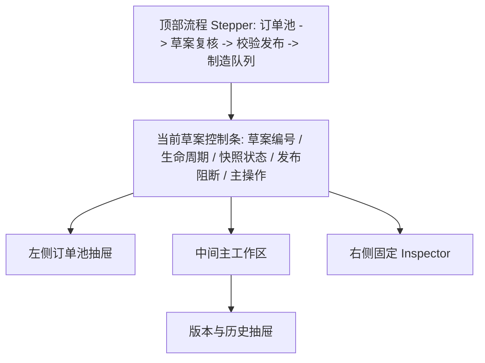
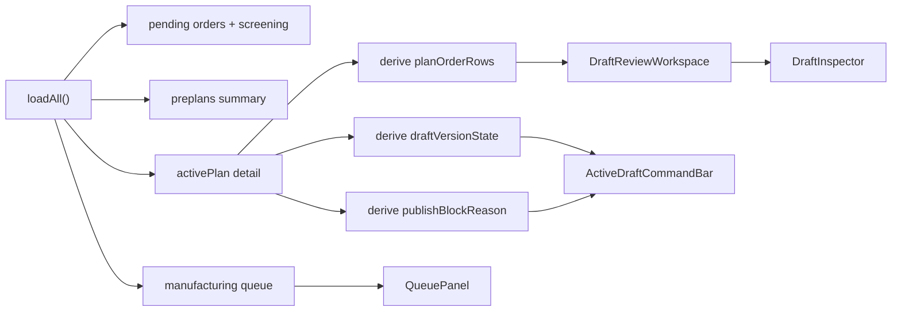

# 排程工作台订单、草案、版本 UI 改版设计

日期：2026-05-23

状态：已确认设计方向，待实施计划拆分

## 1. 背景

当前排程工作台已经具备订单初筛、预排草案、订单快照、策略快照、校验、人工调整、发布审计和制造队列推进能力。但页面把订单池、草案历史、草案状态、订单复核、资源视图、制造队列和版本信息并列展示，导致计划员需要自己拼接业务流程。

本次改版采用已确认的 **A 方案：流程驱动控制台**。核心不是新增排程能力，而是重排信息架构，让页面围绕“当前草案下一步做什么”组织。

## 2. 目标

用户打开 `/workbench` 后，应在 5 秒内回答：

- 当前是否存在正在复核的预排草案。
- 当前草案是否可以发布。
- 如果不能发布，阻断原因是什么。
- 哪些订单最需要处理，包括未排、延期、可排未落位、校验阻断。
- 草案使用的订单快照和策略快照是否过期。
- 下一步主操作是什么：创建草案、校验方案、重新预排、确认发布、查看制造队列。

## 3. 非目标

- 不修改排程算法、换产规则、订单初筛规则或 API 合约。
- 不把订单输入在本阶段强制 HTTP 化以外的新流程。
- 不把制造队列扩展为真实车间执行系统。
- 不新增复杂权限模型。
- 不把每个历史草案做成完整独立页面，本阶段保留在工作台内管理。

## 4. 设计原则

### 4.1 一个主叙事

主屏只服务当前草案复核。历史草案、策略版本、订单版本和审计信息不再抢占主视觉，默认以状态摘要和抽屉方式展示。

### 4.2 版本是业务状态，不是主导航

计划员优先看到：

- 当前策略
- 策略已变化，需要重新预排
- 订单快照已过期，需要重新预排
- 草案已废弃
- 草案已发布

`policy_version`、订单 revision、snapshot hash 等技术字段只在展开详情时展示。

### 4.3 创建前突出订单池，创建后突出复核

没有草案时，订单池是主入口。已有草案时，订单池折叠为抽屉或窄栏，把屏幕宽度让给复核表和 Inspector。

### 4.4 先处理异常，再看资源

默认主区展示订单维度复核表，优先显示“需处理”订单。资源视图和制造队列是主区二级 Tab，不应挤压复核流程。

### 4.5 手工调整是受控功能

人工拖拽或调整不是绕过系统，而是系统功能。每次调整必须保留原因、前后差异、操作者和后续校验状态。

## 5. 页面结构

### 5.1 顶部流程 Stepper

位置：页面头部下方。

步骤：

1. 订单池：选择 `PENDING` 订单并查看初筛。
2. 草案复核：查看未排、延期、校验阻断、人工调整。
3. 校验发布：显式校验后确认进入制造队列。
4. 制造队列：发布后推进 `QUEUED / READY / IN_PRODUCTION / COMPLETED`。

当前步骤由业务状态自动计算，不由用户手动切换。

### 5.2 当前草案控制条

位置：Stepper 下方，主工作区上方。

展示内容：

- 草案编号，例如 `#176`。
- 生命周期，例如 `待复核`、`已校验`、`已发布`、`已废弃`。
- 发布状态，例如 `可发布`、`发布受阻`。
- 策略状态，例如 `当前策略`、`策略已变化`。
- 订单快照状态，例如 `订单快照有效`、`订单已修订`。
- 关键计数：输入、已排、未排、延期、可排未落位。

主操作按钮只保留一个最高优先动作：

- 无草案：`创建预排程`
- `DRAFT` 且未校验：`校验方案`
- 校验有硬错误：`查看阻断`
- 快照过期：`重新预排`
- `VALIDATED` 且可发布：`确认进入制造队列`
- `CONFIRMED`：`查看制造队列`
- `CANCELLED`：`重新选择订单`

次级操作放在同一控制条右侧：

- 草案版本
- 废弃草案
- 刷新
- 配置策略

### 5.3 左侧订单池抽屉

无草案时：

- 展开显示搜索、筛选、初筛 badge、全选当前筛选、清空已选、创建预排程。
- 订单卡片展示订单号、产品、规格、交期、类型、初筛状态和第一条处理建议。

有草案时：

- 默认折叠为窄栏，只显示待排订单总数和已选数量。
- 用户可展开，但展开不应改变当前草案复核上下文。
- 创建新草案时需要明确提示：新草案不会修改当前草案，除非用户确认打开新草案。

### 5.4 中间主工作区

默认 Tab：`订单复核`。

二级 Tab：

- `订单复核`
- `资源视图`
- `制造队列`

订单复核内的一级焦点不是平均展示所有 bucket，而是默认进入 `需处理`。

`需处理` 聚合：

- 草案校验硬阻断
- 未排订单
- 可排但未落位订单
- 延期订单
- 订单快照过期
- 策略快照过期

表格建议列：

| 列 | 内容 |
| --- | --- |
| 订单 | 订单号、订单类型 badge |
| 产品/规格 | 产品类型、幅宽、厚度、洁净等级、层数 |
| 交期 | 目标交期、延期风险 |
| 状态 | 已排、未排、延期、可排未落位、校验阻断 |
| 机台/时间 | 已落位时显示机台和计划时间，未落位显示 `-` |
| 根因/指导 | 一句话根因和下一步建议 |

长根因不撑宽表格，完整证据放在右侧 Inspector。

### 5.5 资源视图

资源视图保留吹膜机维度和拖拽调整能力，但降级为主工作区 Tab。

要求：

- 切换到资源视图不清空当前选中订单。
- 资源卡片点击后仍更新右侧 Inspector。
- 拖拽调整只在可编辑草案状态启用。
- 调整提交后草案应回到需要重新校验的状态。

### 5.6 制造队列

制造队列不再作为底部长期展开区域。

规则：

- 草案未发布时，只显示紧凑摘要或空状态。
- 发布成功后，制造队列 Tab 显示队列项和可用状态推进动作。
- `ON_HOLD`、`CANCELLED` 必须要求原因。
- 队列操作后刷新订单状态、队列状态和审计摘要。

### 5.7 右侧 Inspector

Inspector 固定在右侧，是复核和审计入口。

分区：

1. 当前草案状态
   - 生命周期
   - 发布阻断
   - 校验摘要
   - 策略/订单快照状态

2. 当前订单复核
   - 订单基本信息
   - 当前 bucket
   - 根因
   - 指导建议
   - 证据，例如机台能力、交期、换产、物料、洁净等级、规则开关

3. 换产与资源说明
   - 前序订单
   - 换产开始和生产开始
   - setup components
   - 若无启用换产规则，应明确显示“无启用换产规则产生换产时间”

4. 人工调整
   - 机台
   - 开始时间
   - 结束时间
   - 原因代码
   - 原因说明
   - 提交后提示需要重新校验

5. 审计摘要
   - 最近发布审计
   - 最近人工调整
   - 最近队列状态变化
   - 最近废弃原因

### 5.8 草案版本抽屉

草案历史从常驻横向列表改为抽屉。

默认展示：

- 当前草案
- 最近 3 个有效草案
- 最近废弃草案数量

筛选：

- 全部
- 待复核
- 已校验
- 已发布
- 已废弃
- 已过期

草案卡片展示：

- `#run_id`
- 生命周期
- 输入/已排/未排/延期
- 策略状态
- 订单快照状态
- 废弃原因或发布摘要

## 6. 状态映射

### 6.1 草案主状态

| 后端状态 | UI 主状态 | 主操作 |
| --- | --- | --- |
| 无 active plan | 尚未创建草案 | 创建预排程 |
| `DRAFT` | 待复核 | 校验方案 |
| `DRAFT` + stale | 草案已过期 | 重新预排 |
| `DRAFT` + hard errors | 发布受阻 | 查看阻断 |
| `VALIDATED` | 已校验 | 确认进入制造队列 |
| `CONFIRMED` | 已发布 | 查看制造队列 |
| `CANCELLED` | 已废弃 | 重新选择订单 |
| `SUPERSEDED` | 已被替代 | 打开最新草案 |

### 6.2 版本状态

引入前端派生状态 `draftVersionState`：

| 派生状态 | 条件 | UI 文案 |
| --- | --- | --- |
| `current` | 策略和订单快照均有效 | 当前策略，订单快照有效 |
| `policy_stale` | 存在 `policy_snapshot_stale` | 策略已变化，需要重新预排 |
| `order_stale` | 存在 `order_snapshot_stale` | 订单已修订，需要重新预排 |
| `mixed_stale` | 策略和订单均过期 | 策略和订单均已变化 |
| `cancelled` | 草案已废弃 | 草案已废弃 |
| `confirmed` | 草案已发布 | 已发布为制造队列 |

### 6.3 订单复核 bucket

| Bucket | 来源 | 用途 |
| --- | --- | --- |
| 草案阻断 | validation hard errors | 发布前必须处理 |
| 未排订单 | `blocked_orders` | 解释算法无法落位原因 |
| 可排未落位 | `unplaced_schedulable_orders` | 避免误归类为已排 |
| 延期订单 | `late_orders` | 指导交期或机台调整 |
| 已排订单 | `scheduled_orders` | 查看已落位结果 |
| 输入订单 | `input_orders` | 对账输入范围 |

默认选中顺序：

1. 草案阻断
2. 未排订单
3. 可排未落位
4. 延期订单
5. 已排订单
6. 输入订单

## 7. 组件与文件方案

第一阶段可以先在 `web/src/pages/ScheduleWorkbench.jsx` 内拆内部组件，减少文件迁移风险。稳定后再迁移到 `web/src/components/workbench/`。

建议组件：

- `WorkflowStepper`
  - 输入：`activePlan`、`queue`、`validation`
  - 输出：当前流程步骤和步骤状态展示

- `ActiveDraftCommandBar`
  - 输入：`activePlan`、`planOrderCounts`、`draftVersionState`、`publishBlockReason`、`canConfirm`
  - 输出：当前草案摘要、主操作、次级操作

- `OrderPoolDrawer`
  - 输入：待排订单、筛选条件、初筛结果、选中订单、是否折叠
  - 输出：选择订单、创建草案、展开/收起

- `DraftReviewWorkspace`
  - 输入：`workspaceView`、bucket rows、当前选中订单
  - 输出：订单选择、Tab 切换、资源拖拽入口、队列入口

- `DraftInspector`
  - 输入：当前草案、当前订单、当前任务、validation、diagnostics、audit、adjustment
  - 输出：人工调整、废弃原因、队列推进原因

- `DraftVersionDrawer`
  - 输入：preplans、activePlan、version state
  - 输出：打开草案、筛选草案历史

- `QueuePanel`
  - 输入：manufacturing queue rows、可用迁移
  - 输出：状态推进、原因提交

## 8. 数据流

派生逻辑应集中在组件渲染前的 `useMemo`，不要在 JSX 中重复拼接。

重点派生对象：

- `workflowStep`
- `draftVersionState`
- `primaryAction`
- `reviewFocusTab`
- `reviewRows`
- `selectedOrderContext`
- `queueSummary`

## 9. 错误与空状态

### 9.1 无草案

主区显示创建引导，但不要做营销式空页面。突出订单池和创建按钮。

文案：

> 选择待排订单后创建预排程草案。创建草案不会改变订单状态，只有发布后才进入制造队列。

### 9.2 草案过期

当策略或订单快照过期：

- 控制条显示强提示。
- 主操作变为 `重新预排`。
- 发布按钮禁用。
- Inspector 显示过期证据。

### 9.3 发布受阻

发布受阻时：

- 控制条显示最短阻断原因。
- 主区自动聚焦 `需处理`。
- Inspector 展示当前选中阻断的完整证据和指导建议。

### 9.4 已废弃草案

已废弃草案只读展示：

- 控制条显示废弃原因。
- 人工调整、校验、发布按钮禁用。
- 可从版本抽屉打开，但默认不抢占当前有效草案。

## 10. 编码阶段

### P0：信息架构落地

目标：让主屏围绕当前草案复核。

任务：

- 新增 `WorkflowStepper`。
- 新增 `ActiveDraftCommandBar`。
- 把订单池改成创建前展开、创建后抽屉。
- 主工作区默认聚合 `需处理`。
- 右侧 Inspector 固定展示草案状态和当前订单根因。
- 保留现有创建、校验、调整、废弃、发布流程。

验收：

- 无草案时订单池是主要入口。
- 有草案时主区优先显示复核表。
- 发布受阻原因在控制条和 Inspector 都可见。
- 选中订单后 Inspector 无需滚动到页面底部即可看到。

### P1：版本与队列降噪

目标：降低草案历史和版本信息噪音。

任务：

- 草案历史改为版本抽屉。
- 增加 `draftVersionState` 派生逻辑。
- 策略/订单快照过期显示为业务文案。
- 制造队列改为主工作区 Tab。
- 资源视图保留拖拽调整，但降级为二级 Tab。

验收：

- 主区不再常驻展示 8 个历史草案卡片。
- 用户能看懂“策略已变化/订单已修订/当前策略”。
- 发布后制造队列能展开查看和推进。

### P2：视觉和测试完善

目标：提升演示稳定性和回归能力。

任务：

- 补充 `data-testid`。
- 增加 e2e 覆盖：无草案、创建草案、打开版本抽屉、策略过期、订单过期、资源视图切换、队列推进。
- 浏览器检查 `1440x900`、`1280x720`、`1024x768`。
- 清理按钮文案、状态文案、长文本换行和横向滚动。

验收：

- `npm run build` 通过。
- `npm run e2e -- workbench.spec.js` 通过。
- 关键视口下 Inspector 不掉到主区下方。
- 主表根因列不会撑破布局。

## 11. 验证清单

实施后至少验证：

- 进入 `/workbench`，没有草案时能选择订单并创建草案。
- 创建草案后订单仍是 `PENDING`，页面进入草案复核步骤。
- 存在阻断时默认展示需处理订单。
- 选择未排订单，Inspector 显示根因和指导建议。
- 选择延期订单，Inspector 显示延期原因和调整方向。
- 切换资源视图后，当前订单上下文不丢失。
- 发起人工调整后，草案需要重新校验。
- 校验通过后才能确认进入制造队列。
- 发布后订单变为 `SCHEDULED`，队列写入 `QUEUED`。
- 队列推进写入审计，必要动作要求原因。
- 策略或订单快照过期时，发布被禁用并提示重新预排。

## 12. 风险与控制

| 风险 | 控制 |
| --- | --- |
| 单次重构过大 | 先在 `ScheduleWorkbench.jsx` 内部拆组件，不立即迁移目录 |
| 现有 e2e 选择器失效 | 保留旧 `data-testid`，新增布局 test id |
| 版本信息被隐藏过度 | 控制条保留状态，抽屉展示完整版本详情 |
| 资源拖拽被新布局破坏 | 资源视图逻辑不改，只移动到 Tab |
| 队列操作入口不明显 | 发布后控制条主操作变为 `查看制造队列` |

## 13. 设计结论

采用流程驱动控制台后，工作台的信息层级变为：

1. 当前草案和下一步操作。
2. 需处理订单及其根因。
3. 当前订单 Inspector。
4. 资源视图和制造队列。
5. 草案版本、策略快照、订单快照和审计详情。

这条路线最适合当前项目阶段：既保留系统辅助排程与人工复核的现实场景，也避免把计划员淹没在草案、版本和审计细节里。

## 14. 实施验证记录

完成日期：2026-05-23

- `python -m pytest tests/test_order_flow_sprint1.py tests/test_order_screening.py tests/test_order_import_flow.py tests/test_publish_audit.py tests/test_queue_transitions.py tests/test_rule_enablement.py tests/test_policy_settings.py tests/test_setup_time.py -q`：61 passed, 6 subtests passed。
- `cd web; npm run lint`：通过。
- `cd web; npm run build`：通过，仍有既有 chunk-size warning。
- `cd web; npm run e2e -- workbench.spec.js`：5 passed, 1 skipped。
- `cd web; npm run e2e -- smoke-routes.spec.js`：1 passed。

已验证 UI：

- 顶部流程 Stepper 可见，并随草案状态切换当前步骤。
- 当前草案控制条展示草案编号、生命周期、发布状态、版本状态和主操作。
- 订单池创建前展开，创建后折叠为抽屉。
- 主工作区默认聚焦需处理订单。
- 草案版本通过抽屉查看，不再常驻挤压主区。
- 制造队列在主工作区 Tab 内展示和推进。
- Inspector 固定展示当前草案状态、当前订单根因、换产说明、人工调整入口和审计摘要。

响应式验证：

| 视口 | 结果 |
| --- | --- |
| `1440x900` | 主工作区与 Inspector 同行，Inspector 可见，无横向滚动。 |
| `1280x720` | 主工作区与 Inspector 同行，Inspector 可见，无横向滚动。 |
| `1024x768` | 工作区按响应式规则堆叠，无横向滚动。 |
