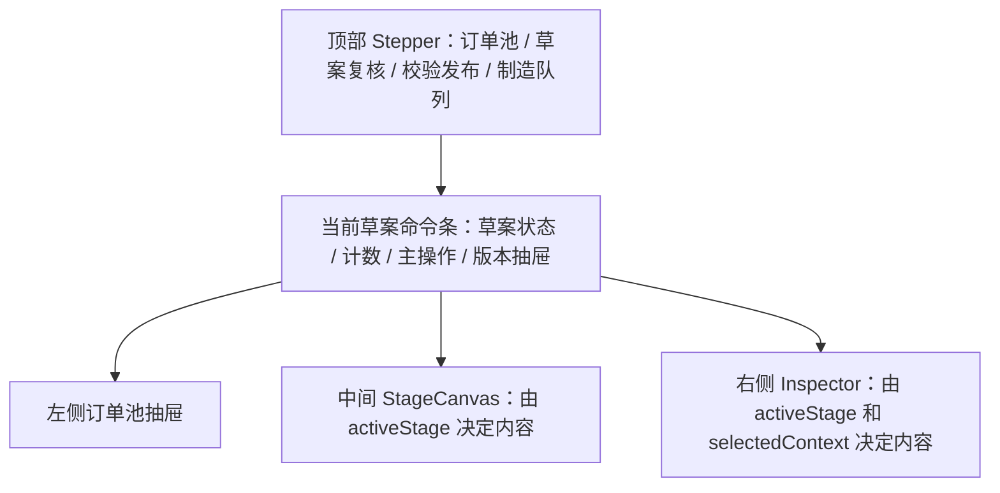

# 排程工作台阶段驱动主内容区设计

日期：2026-05-23

状态：设计已确认，等待用户 review 后进入实施计划

## 1. 背景

当前 `/workbench` 已完成订单池、预排程草案、草案复核、人工调整、校验发布、制造队列和审计入口的闭环。上一版改版已经把历史草案降噪为抽屉，并增加了 4 阶段 Stepper：

1. 订单池
2. 草案复核
3. 校验发布
4. 制造队列

但当前 Stepper 主要承担状态展示。中间主内容区仍由 `订单复核 / 资源视图 / 制造队列` 三个全局 Tab 控制，导致页面看起来已经分阶段，但实际工作内容仍挤在同一个草案面板里。用户需要同时理解订单池、草案计数、订单复核表、资源视图、制造队列、右侧 Inspector 和草案版本抽屉，演示时主线不够直观。

本次设计目标是把 4 阶段从“状态条”升级为“主工作区模式”。用户选择或系统进入某个阶段后，中间主区只展示该阶段最重要的任务。

## 2. 目标

- 让计划员在 5 秒内判断当前处于哪一阶段、当前阶段要处理什么、下一步主操作是什么。
- 中间主内容区根据 4 阶段切换内容，而不是把订单复核、资源视图、发布校验和制造队列并列堆放。
- 保留人工复核和人工调整能力，明确系统不是自动排程替代人，而是辅助计划员减少经验性排程工作。
- 保留资源视图和制造队列能力，但把它们放到对应阶段里，降低主区噪音。
- 保持当前 API、算法和业务状态不变，本次只调整信息架构和交互组织。

## 3. 非目标

- 不修改排程算法、规则启停逻辑、换产时间计算或订单初筛规则。
- 不新增独立路由，例如 `/workbench/orders`、`/workbench/drafts`、`/workbench/publish`、`/workbench/queue`。
- 不把订单输入、规则配置、机台配置塞进工作台主流程；这些仍属于配置页面或订单页面。
- 不引入复杂权限模型。
- 不把制造队列扩展成真实 MES 执行系统，本阶段只展示和推进队列状态。

## 4. 设计原则

### 4.1 阶段决定主内容

顶部 Stepper 不再只是状态提示，而是主区切换器。当前阶段决定中间 `StageCanvas` 渲染什么内容：

- 订单池阶段看订单选择和初筛。
- 草案复核阶段看异常订单、根因和人工调整。
- 校验发布阶段看校验结果、发布阻断和发布清单。
- 制造队列阶段看队列项、状态推进和审计。

### 4.2 自动推导与人工查看并存

系统根据草案生命周期自动推导推荐阶段，但用户可以点击 Stepper 切换查看其他阶段。

示例：

- 无草案时默认进入订单池。
- 创建草案后默认进入草案复核。
- 草案校验通过且可发布时默认进入校验发布。
- 发布后默认进入制造队列。

用户手动切换阶段只改变 UI 视图，不改变草案状态。

### 4.3 全局只保留一个主操作

顶部命令条继续保留一个最高优先级动作，例如：

- 创建预排程
- 校验方案
- 查看阻断
- 确认进入制造队列
- 查看制造队列

阶段主区可以有局部操作，但不能和顶部主操作互相冲突。

### 4.4 Inspector 固定，但内容随阶段变化

右侧 Inspector 保持固定位置，但不再展示所有上下文的堆叠信息。它根据当前阶段展示当前对象：

- 订单池阶段：当前待排订单的初筛原因和建议。
- 草案复核阶段：当前草案订单的根因、换产说明、人工调整入口和审计摘要。
- 校验发布阶段：当前校验项、发布阻断、快照过期证据和发布审计。
- 制造队列阶段：当前队列项、状态流转、暂停或取消原因。

### 4.5 资源视图是草案复核的辅助视角

资源视图不再作为全局主 Tab，而是草案复核阶段内的二级视角。计划员先处理“未排、延期、阻断、可排未落位”等订单维度问题，再进入资源视图查看吹膜机维度排布。

## 5. 页面结构



布局保持三栏基础：

- 左侧：订单池。订单池阶段展开，其他阶段默认折叠。
- 中间：主工作区 `StageCanvas`。
- 右侧：固定 Inspector。

响应式规则保持现有方向：宽屏三栏，中等宽度压缩订单池，窄屏按订单池、主区、Inspector 纵向堆叠。

## 6. 阶段设计

### 6.1 订单池阶段

触发条件：

- 无有效草案。
- 用户点击 Stepper 的“订单池”。
- 用户点击顶部主操作“重新选择订单”。

主内容区：

- 待排订单表或订单卡片列表。
- 搜索、订单类型筛选、洁净等级筛选、初筛状态筛选。
- 初筛汇总：可排、风险、阻断。
- 已选择订单清单和创建草案入口。
- 空状态提示：当前没有 `PENDING` 订单，或当前筛选条件下没有订单。

左侧订单池：

- 在本阶段可以不再只是窄栏，而是作为主入口突出展示。
- 若中间主区也展示订单池，左侧可降级为筛选摘要，避免重复。

Inspector：

- 当前选中待排订单。
- 订单规格、交期、类型。
- 初筛状态。
- 初筛根因。
- 第一条处理建议。

验收要点：

- 无草案时打开页面，不需要理解草案表即可完成订单选择和创建。
- 订单初筛风险不会只藏在左侧小卡片里。

### 6.2 草案复核阶段

触发条件：

- 创建草案后。
- 草案为 `DRAFT` 或 `VALIDATED` 但仍存在阻断、延期、快照过期、可排未落位。
- 用户点击 Stepper 的“草案复核”。

主内容区：

- 默认视图为“订单复核”。
- 一级聚焦为“需处理”，聚合以下内容：
  - 草案校验硬阻断。
  - 未排订单。
  - 可排但未落位订单。
  - 延期订单。
  - 快照过期风险。
- 二级视图包括：
  - 订单复核。
  - 资源视图。

资源视图：

- 保留吹膜机维度排布。
- 保留已落位任务选择。
- 后续人工拖拽派单能力应放在此阶段，不放到发布阶段。

Inspector：

- 当前草案状态。
- 当前选中订单根因。
- 换产说明。
- 人工调整入口。
- 调整记录和最近审计。

验收要点：

- 创建草案后主区直接进入“需处理”，而不是要求用户先理解所有 Tab。
- 资源视图仍可访问，但不抢占默认主线。
- 选择订单后右侧根因和人工调整入口稳定可见。

### 6.3 校验发布阶段

触发条件：

- 草案校验通过或需要显式查看校验结果。
- 用户点击顶部主操作“校验方案”后。
- 用户点击 Stepper 的“校验发布”。

主内容区：

- 发布准备清单：
  - 草案生命周期。
  - 订单快照状态。
  - 策略快照状态。
  - 校验状态。
  - 硬阻断数量。
  - 警告数量。
  - 已排订单数量。
  - 未排订单数量。
  - 发布后会进入制造队列的订单数量。
- 校验项列表：
  - 硬阻断置顶。
  - 警告次之。
  - 通过项只汇总，不铺满页面。
- 发布拦截原因：
  - 快照过期。
  - 草案未校验。
  - 存在硬阻断。
  - 策略禁止带警告发布。
  - 没有已排任务。
- 发布确认区：
  - 可发布时显示确认按钮。
  - 不可发布时显示具体下一步，例如“返回草案复核查看阻断”或“重新预排”。

Inspector：

- 当前选中校验项。
- 证据字段，例如订单、机台、规则、阈值、快照版本。
- 发布审计摘要。

验收要点：

- 发布前用户不需要在订单复核表和右侧校验列表之间来回找原因。
- “为什么不能发布”必须在本阶段主区直接可见。

### 6.4 制造队列阶段

触发条件：

- 草案已 `CONFIRMED`。
- 当前草案已有制造队列项。
- 用户点击 Stepper 的“制造队列”。

主内容区：

- 当前草案的制造队列表。
- 队列状态汇总：
  - `QUEUED`
  - `READY`
  - `IN_PRODUCTION`
  - `ON_HOLD`
  - `COMPLETED`
  - `CANCELLED`
- 状态推进操作。
- 暂停和取消必须填写原因。
- 最近状态变更原因。

Inspector：

- 当前队列项详情。
- 来源草案。
- 订单信息。
- 计划开始和结束时间。
- 最近流转记录。
- 操作审计。

验收要点：

- 发布成功后主区自动进入制造队列阶段。
- 制造队列不再只是草案复核下方的附属面板。

## 7. 状态模型

新增前端状态：

```text
activeStage = order_pool | draft_review | validate_publish | manufacturing_queue
recommendedStage = deriveWorkflowStep(...)
stageOverride = null | activeStage
```

规则：

- `recommendedStage` 由当前草案、草案生命周期、校验状态、队列状态推导。
- `activeStage = stageOverride || recommendedStage`。
- 当用户点击 Stepper 时设置 `stageOverride`。
- 当创建新草案、打开历史草案、废弃草案、发布草案时清空或重置 `stageOverride`，避免旧阶段误导新上下文。

推荐阶段映射：

| 条件 | recommendedStage |
| --- | --- |
| 无 activePlan | `order_pool` |
| activePlan 为 `DRAFT` | `draft_review` |
| activePlan 有硬阻断 | `draft_review` |
| activePlan 快照过期 | `draft_review` |
| activePlan 为 `VALIDATED` 且可发布 | `validate_publish` |
| activePlan 为 `CONFIRMED` | `manufacturing_queue` |
| 当前草案已有 queue rows | `manufacturing_queue` |

## 8. 组件方案

优先在 `web/src/pages/ScheduleWorkbench.jsx` 内部拆分，稳定后再迁移到 `web/src/components/workbench/`。

建议组件：

- `WorkflowStepper`
  - 支持点击。
  - 显示推荐阶段与当前查看阶段。
  - 提供 `data-testid="workbench-stage-<stage>"`。

- `StageCanvas`
  - 输入 `activeStage`、`activePlan`、订单池、校验、队列、选择上下文。
  - 根据阶段渲染对应主内容。

- `OrderPoolStage`
  - 承载订单选择、初筛、创建草案。

- `DraftReviewStage`
  - 承载订单复核和资源视图二级切换。

- `ValidatePublishStage`
  - 承载发布准备清单、校验项和发布拦截说明。

- `ManufacturingQueueStage`
  - 承载制造队列表和状态推进。

- `StageInspector`
  - 根据 `activeStage` 和 `selectedContext` 渲染不同 Inspector 卡片。

已有 `workbenchViewModel.js` 应继续承载纯派生逻辑。新增阶段推导和发布准备清单也应优先放入该文件，避免 JSX 内重复拼接业务状态。

## 9. 交互规则

### 9.1 点击 Stepper

- 点击阶段只改变主区视图，不直接调用后端。
- 点击不可用阶段时不禁用，而是展示该阶段的空状态。例如未发布时点击制造队列，显示“当前草案尚未进入制造队列”。
- 当前推荐阶段用主视觉高亮。
- 用户手动查看的非推荐阶段用轻量提示说明“当前草案推荐处理阶段是 XXX”。

### 9.2 顶部主操作

顶部主操作继续按业务优先级执行：

- 无草案且已选择订单：创建预排程。
- 草案待校验：校验方案。
- 草案有阻断：切到草案复核并定位“需处理”。
- 草案可发布：确认进入制造队列。
- 草案已发布：切到制造队列阶段。

### 9.3 创建和打开草案

- 创建草案成功后，清空 `stageOverride`，默认进入草案复核阶段。
- 打开历史草案后，清空 `stageOverride`，按草案状态进入推荐阶段。
- 废弃草案后，默认进入订单池或草案复核只读态，取决于是否仍有 activePlan。

### 9.4 订单选择上下文

- 订单池阶段选中的是待排订单。
- 草案复核阶段选中的是草案订单。
- 资源视图选中任务后仍映射到草案订单。
- 校验发布阶段选中的是校验项，若校验项关联订单，则 Inspector 可联动显示订单。
- 制造队列阶段选中的是队列项。

## 10. 空状态与异常状态

- 订单池无订单：提示当前没有待排订单，并提供订单页面入口。
- 草案复核无异常：显示“当前草案暂无需处理订单”，并引导进入校验发布。
- 校验发布无校验结果：显示“请先校验方案”，主操作为“校验方案”。
- 校验发布不可发布：展示明确阻断原因和下一步入口。
- 制造队列未发布：显示“当前草案尚未进入制造队列”，引导返回校验发布。
- 已废弃草案：所有调整、校验、发布操作禁用，展示废弃原因。

## 11. 视觉与布局要求

- Stepper 使用按钮语义，保持 4 个阶段同一行；窄屏换成两列或一列。
- `StageCanvas` 标题直接表达阶段任务，例如“订单池”、“草案复核”、“校验发布”、“制造队列”。
- 阶段内二级切换只在需要时出现。草案复核阶段可以有“订单复核 / 资源视图”，其他阶段不强行放 Tab。
- 避免主区内再嵌套大型卡片。表格、清单和状态条直接作为主内容。
- 右侧 Inspector 固定宽度，长内容换行，不允许把主区挤出横向滚动。
- 当前三栏结构在 `1280px` 仍应可用；`1120px` 以下堆叠。

## 12. 测试方案

需要补充或调整 e2e：

- 打开 `/workbench` 无草案时，默认阶段为订单池，主区显示订单选择和创建草案。
- 创建草案后，默认阶段切到草案复核，主区显示“需处理”。
- 点击“资源视图”只在草案复核阶段内部切换，不改变阶段。
- 点击“校验发布”阶段，主区显示发布准备清单。
- 存在硬阻断时，发布按钮禁用或主操作跳回草案复核。
- 校验通过后，校验发布阶段显示“确认进入制造队列”。
- 发布成功后，默认阶段切到制造队列，队列表可见。
- 点击任一 Stepper 阶段，主区标题和关键内容随之变化。
- `1440x900`、`1280x720`、`1024x768` 下无横向滚动，Inspector 不与主区重叠。

## 13. 分阶段落地建议

### P0：阶段驱动主区

- 增加 `activeStage`、`recommendedStage`、`stageOverride`。
- Stepper 改为可点击。
- 增加 `StageCanvas`。
- 把现有订单复核、资源视图、制造队列移动到对应阶段。
- 保留原有按钮和 test id，降低回归风险。

### P1：校验发布阶段补强

- 新增发布准备清单。
- 把发布阻断从右侧校验列表提升到主区。
- 校验项支持点击并联动 Inspector。

### P2：Inspector 阶段化

- 将 Inspector 拆成阶段卡片。
- 订单池显示初筛，草案复核显示根因和调整，校验发布显示校验证据，制造队列显示流转审计。

### P3：视觉和响应式整理

- 优化 Stepper 和 StageCanvas 的状态提示。
- 清理旧的全局 Tab 样式。
- 补齐响应式截图验证。

## 14. 风险与控制

| 风险 | 控制 |
| --- | --- |
| 单次移动 JSX 过多 | 先只抽 `StageCanvas`，不改后端和算法 |
| e2e 选择器失效 | 保留现有关键 `data-testid`，新增阶段 test id |
| 用户误以为点击阶段会改变状态 | 阶段切换只影响查看，命令条主操作才触发业务动作 |
| 资源视图被隐藏过深 | 放在草案复核阶段内，并在有已排任务时显示明显入口 |
| 发布逻辑被 UI 改版误伤 | `canConfirm`、`publishBlockReason`、校验 API 调用保持原逻辑 |
| 移动端内容过长 | 维持表格横向容器，窄屏下三栏堆叠 |

## 15. 设计结论

采用阶段驱动主内容区后，工作台的信息架构从“一个页面堆多个能力”变成“每个阶段只展示当前最重要的任务”。这更符合订单入库、订单初筛、订单预排程、订单修订、排程发布、制造队列推进的实际流程。

本设计适合当前项目阶段：既保留系统辅助排程和人工复核的现实场景，也避免过早拆成多页面或重构后端契约。下一步应先执行 P0 和 P1，让主区真正跟随 4 阶段切换，再逐步做 Inspector 阶段化和视觉细化。
