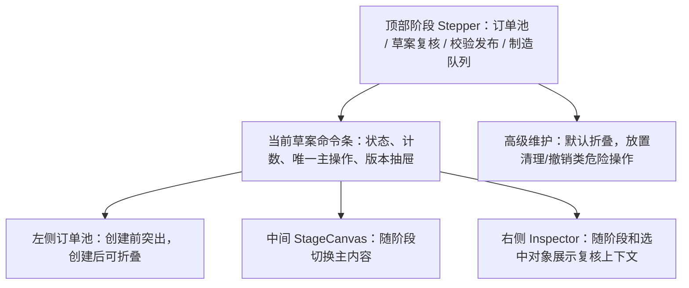

# 排程工作台交互去重与阶段化 Goal Implementation Plan

> **For agentic workers:** REQUIRED SUB-SKILL: Use `superpowers:executing-plans` to implement this plan task-by-task. Steps use checkbox syntax for tracking and are marked complete after execution.

**Goal:** 将 `/workbench` 从“多个入口堆叠的排程页面”整理成“4 阶段驱动、主操作唯一、复核上下文清晰”的排程工作台。

**Architecture:** 保持现有后端排程算法、草案生命周期、发布规则和制造队列 API 不变。本计划只调整工作台信息架构、交互入口、阶段主内容、Inspector 展示和 e2e 覆盖。

**Tech Stack:** React 19, Vite, Playwright e2e, existing CSS in `web/src/index.css`, existing API client in `web/src/api/client.js`.

**Execution Status:** 已完成，2026-05-23 已按 P0/P1/P2 闭环验证。

---

## 1. 背景

当前排程工作台已经具备订单池、预排程草案、订单复核、人工调整、校验发布、制造队列和审计能力，但页面主区仍存在以下问题：

- 同一业务动作在多个区域重复出现，例如创建草案、刷新、校验方案、确认进入制造队列、废弃草案。
- 4 阶段 Stepper 已经存在，但主内容仍把订单复核、资源视图、制造队列堆在一起，阶段感不足。
- 无草案、未校验、未发布、无制造队列等状态下，页面仍可能显示禁用按钮、空表头或上下文无关卡片。
- 维护类危险操作暴露在主流程顶部，和计划员高频操作混在一起。
- 右侧 Inspector 信息堆叠过多，没有严格跟随当前阶段和当前选中对象收敛。

本计划把问题拆成 P0/P1/P2 三层：P0 先去掉会误导用户的交互，P1 重组主内容区，P2 补齐语义、反馈和测试稳定性。

## 2. 非目标

- 不修改排程算法、换产时间计算、机台匹配逻辑或规则求解逻辑。
- 不新增订单生命周期状态。
- 不改变 `DRAFT -> VALIDATED -> CONFIRMED/CANCELLED` 草案生命周期。
- 不把订单输入、规则配置、机台配置塞进工作台主流程。
- 不移除人工复核、人工调整、审计记录能力。

## 3. 目标页面结构



## 4. 文件边界

- Modify `web/src/pages/ScheduleWorkbench.jsx`
  - 统一主操作入口。
  - 实现阶段主内容区。
  - 收敛 Inspector。
  - 隐藏或降级维护操作。

- Modify `web/src/pages/workbenchViewModel.js`
  - 补充阶段常量、发布 checklist、按钮文案和计数派生逻辑。
  - 保持纯函数，便于测试和复用。

- Modify `web/src/index.css`
  - 增加阶段主区、维护折叠区、空状态、紧凑订单筛选、Inspector 状态样式。
  - 修复桌面和窄屏布局溢出。

- Modify `web/e2e/workbench.spec.js`
  - 覆盖搜索、筛选、创建、校验、选择订单、人工调整、废弃、发布拦截、制造队列。
  - 增加重复按钮数量和空状态断言。

- Modify `web/e2e/config-orders.spec.js` if selectors are affected
  - 将旧草案选择器迁移到版本抽屉或新的稳定 `data-testid`。

## 5. P0: 交互去重与误导状态修复

**Goal:** 消除同屏重复入口和误导性空壳，让用户一眼知道当前阶段能做什么。

**Suggested commit:** `fix: clean up workbench primary actions`

### Task P0.1: 统一创建草案入口

- [x] 移除页头常驻 `创建预排程`。
- [x] 无草案时只在订单池主区显示创建入口。
- [x] 未选择订单时按钮文案使用 `先选择订单`，而不是可执行语气。
- [x] 创建草案后，创建入口退出主流程或降级到订单池阶段。

**Acceptance criteria:**

- 无草案进入 `/workbench`，同屏只有一个创建草案主入口。
- 选择订单后，只有一个主按钮显示待创建订单数量。
- 创建草案后，主操作切换为 `校验方案` 或下一阶段动作。

**Validation:**

```powershell
cd web
npm run e2e -- workbench.spec.js -g "entry points"
```

### Task P0.2: 统一刷新入口

- [x] 保留一个上下文刷新入口。
- [x] 删除页头和命令条之间重复的 `刷新`。
- [x] 刷新后订单池、草案、制造队列和状态提示仍同步更新。

**Acceptance criteria:**

- Playwright 统计可见 `刷新` 按钮数量为 1。
- 刷新不会重置用户当前阶段，除非当前草案状态已经不可用。

**Validation:**

```powershell
cd web
npm run e2e -- workbench.spec.js
```

### Task P0.3: 无草案时隐藏草案业务按钮

- [x] 无活动草案时不渲染 `校验方案`、`确认进入制造队列`、`废弃草案`。
- [x] 主区展示清晰空状态：先选择 PENDING 订单并创建预排程草案。
- [x] 右侧 Inspector 不展示无意义的草案状态空卡。

**Acceptance criteria:**

- 无草案时看不到禁用的草案按钮。
- 空状态包含原因和下一步动作。

**Validation:**

```powershell
cd web
npm run e2e -- workbench.spec.js -g "no-draft"
```

### Task P0.4: 草案操作同屏只保留一个入口

- [x] `ActiveDraftCommandBar` 作为草案全局主操作入口。
- [x] 主工作区头部不再重复渲染 `校验方案 / 确认进入制造队列 / 废弃草案`。
- [x] 校验发布阶段只保留发布门禁说明和必要按钮。

**Acceptance criteria:**

- 草案复核阶段同屏只有一个 `校验方案`。
- 同屏只有一个 `废弃草案`。
- `确认进入制造队列` 只在可发布上下文中出现一次。

**Validation:**

```powershell
cd web
npm run e2e -- workbench.spec.js -g "creates, validates, selects, and cancels"
```

### Task P0.5: 制造队列空状态纠偏

- [x] 未发布时不显示制造队列表格表头。
- [x] 未发布时不显示 `收起/展开` 队列按钮。
- [x] 显示原因：当前草案尚未确认进入制造队列。
- [x] 提供下一步入口：返回校验发布或订单池。

**Acceptance criteria:**

- 未发布草案切到制造队列阶段时，显示空状态而不是空表格。
- 发布成功后，制造队列表格正常显示并可推进状态。

**Validation:**

```powershell
cd web
npm run e2e -- workbench.spec.js -g "publishes a valid draft"
```

## 6. P1: 阶段化主工作区

**Goal:** 让 4 个阶段真正决定中间主内容区，而不是把所有内容挤在同一个面板里。

**Suggested commit:** `feat: align workbench stages with primary workflows`

### Task P1.1: 订单池阶段主区独立化

- [x] 订单池阶段主区承载搜索、筛选、初筛摘要、订单选择、创建草案。
- [x] 有草案后，左侧订单池默认折叠为可恢复抽屉。
- [x] 创建前的初筛风险和阻断原因在主区可见。

**Acceptance criteria:**

- 用户无需依赖左侧窄栏即可完成创建草案前流程。
- 搜索、筛选、全选当前筛选、清空选择均可用。
- 初筛风险不是只藏在小卡片里。

**Validation:**

```powershell
cd web
npm run e2e -- workbench.spec.js -g "searches, filters"
```

### Task P1.2: 草案复核阶段聚焦订单问题

- [x] 创建草案后默认进入草案复核阶段。
- [x] 主区默认显示订单维度复核表。
- [x] 优先展示 `需处理`、`未排`、`延期`、`阻断`、`可排未落位`。
- [x] 资源视图作为草案复核阶段内的二级视角。

**Acceptance criteria:**

- 创建草案后主区不是默认资源视图。
- 点击订单后右侧 Inspector 展示根因、建议、调整入口和审计。
- `可排订单` 不复用 `已排订单` 的前端数组；如当前数据相同，必须能从后端 bucket 语义解释。

**Validation:**

```powershell
cd web
npm run e2e -- workbench.spec.js -g "creates, validates, selects"
python -m pytest tests/test_preplan_contract.py
```

### Task P1.3: 校验发布阶段收敛为 checklist

- [x] 主区展示发布准备清单：草案生命周期、快照状态、校验状态、硬阻断、警告、已排数量、未排数量、发布后队列数量。
- [x] 硬阻断置顶，警告次之，通过项只汇总。
- [x] 不可发布时显示明确下一步，例如返回草案复核、重新预排、处理快照过期。

**Acceptance criteria:**

- `review_required=true` 时，未校验不能发布。
- 存在 hard error 时发布按钮禁用并说明原因。
- 策略是否允许带 warning 发布与全局配置一致。

**Validation:**

```powershell
cd web
npm run e2e -- workbench.spec.js -g "blocks publishing"
npm run e2e -- workbench.spec.js -g "publishes a valid draft"
```

### Task P1.4: 制造队列阶段只展示真实队列

- [x] 未发布时显示队列空状态。
- [x] 发布成功或已有队列时显示队列状态和推进操作。
- [x] `ON_HOLD`、`CANCELLED` 等异常推进仍要求原因。

**Acceptance criteria:**

- 发布成功后自动切到制造队列阶段。
- `QUEUED -> READY -> IN_PRODUCTION -> COMPLETED` 主路径可见。
- 暂停、取消保留原因必填校验。

**Validation:**

```powershell
cd web
npm run e2e -- workbench.spec.js -g "manufacturing queue"
```

### Task P1.5: 维护类危险操作降级

- [x] `清理孤立已排订单` 和 `撤销当前排程` 从主流程页头移出。
- [x] 放入 `高级维护` 折叠区。
- [x] 操作前展示影响说明，并保留二次确认。

**Acceptance criteria:**

- 默认页面顶部不暴露危险维护按钮。
- 展开 `高级维护` 后才可见。
- 操作成功或失败有状态反馈。

**Validation:**

```powershell
cd web
npm run e2e -- workbench.spec.js -g "maintenance"
```

## 7. P2: 体验细节、语义和测试稳定性

**Goal:** 补齐反馈、语义、无障碍和测试钩子，让工作台可以长期维护。

**Suggested commit:** `test: harden workbench interaction coverage`

### Task P2.1: 草案版本抽屉语义

- [x] 当前草案版本项增加明确选中态。
- [x] 版本筛选按钮增加 active 或 `aria-current`。
- [x] 切换草案后显示轻量反馈：已打开草案 #run_id。

**Acceptance criteria:**

- 用户能识别当前打开的是哪个草案。
- 切换后主区、命令条、Inspector 同步更新。

**Validation:**

```powershell
cd web
npm run e2e -- workbench.spec.js -g "version"
```

### Task P2.2: 订单复核筛选降噪

- [x] 保留 `需处理` 为默认入口。
- [x] `输入 / 已排 / 可排 / 未排 / 延期 / 阻断` 作为紧凑筛选。
- [x] 小屏不出现横向溢出。

**Acceptance criteria:**

- 默认视图聚焦需处理订单。
- 所有 bucket 仍可访问。
- 桌面和窄屏布局不产生无意义横向滚动。

**Validation:**

```powershell
cd web
npm run build
npm run e2e -- workbench.spec.js
```

### Task P2.3: Inspector 按阶段收敛

- [x] 订单池阶段展示当前待排订单、初筛根因和建议。
- [x] 草案复核阶段展示当前草案订单根因、换产说明、人工调整入口和审计。
- [x] 校验发布阶段展示发布阻断、校验摘要和最近发布审计。
- [x] 制造队列阶段展示队列状态、最近状态变更和原因。

**Acceptance criteria:**

- Inspector 不再出现与当前阶段无关的空卡片。
- 选择订单后 Inspector 内容稳定联动。
- 发布成功后 Inspector 能显示发布成功上下文，不暴露内部枚举噪音。

**Validation:**

```powershell
cd web
npm run e2e -- workbench.spec.js -g "inspector"
```

### Task P2.4: 轻量状态反馈

- [x] 保存、校验、发布、废弃、队列推进、切换草案均有成功或失败反馈。
- [x] 失败反馈包含下一步建议。
- [x] 保存类开关失败时回滚本地状态。

**Acceptance criteria:**

- 用户执行业务动作后能看到明确结果。
- 网络或接口失败不会让本地 UI 停留在虚假成功状态。

**Validation:**

```powershell
cd web
npm run e2e -- workbench.spec.js
npm run e2e -- config-orders.spec.js
```

### Task P2.5: 稳定测试选择器和回归断言

- [x] 为阶段按钮、主操作、订单池、复核表、版本抽屉、维护折叠区、队列操作补齐 `data-testid`。
- [x] e2e 不依赖不稳定表格行点击，优先点击明确 action button。
- [x] 增加重复按钮数量断言和空状态断言。

**Acceptance criteria:**

- 关键流程测试不依赖纯文本或表格坐标。
- 重复按钮回归会被 e2e 捕获。
- 制造队列空状态回归会被 e2e 捕获。

**Validation:**

```powershell
cd web
npm run e2e
```

## 8. 验收矩阵

| Priority | Scenario | Expected |
| --- | --- | --- |
| P0 | 无草案进入工作台 | 只展示订单池创建入口，不展示草案业务按钮 |
| P0 | 选择订单后 | 只有一个创建草案主按钮，数量正确 |
| P0 | 草案复核阶段 | `校验方案`、`废弃草案` 不重复 |
| P0 | 未发布进入制造队列阶段 | 显示空状态，不显示空表格和折叠按钮 |
| P1 | 订单池阶段 | 主区可独立完成搜索、筛选、选择、创建 |
| P1 | 草案复核阶段 | 默认订单维度复核，资源视图为二级视角 |
| P1 | 校验发布阶段 | 发布 checklist 清晰展示阻断和下一步 |
| P1 | 制造队列阶段 | 只展示真实队列，状态推进可审计 |
| P2 | 版本抽屉 | 当前草案和筛选状态清晰 |
| P2 | Inspector | 内容随阶段和选中对象变化，无无关空卡 |
| P2 | 状态反馈 | 所有关键动作有成功/失败提示 |
| P2 | e2e | 搜索、筛选、创建、校验、调整、废弃、发布拦截、发布成功均覆盖 |

## 9. 闭环验证命令

### P0 最小验证

```powershell
cd web
npm run lint
npm run e2e -- workbench.spec.js
```

### P1 完整业务验证

```powershell
python -m pytest tests/test_preplan_contract.py tests/test_publish_audit.py tests/test_queue_transitions.py
cd web
npm run lint
npm run build
npm run e2e -- workbench.spec.js
```

### P2 全量前端回归

```powershell
cd web
npm run e2e
```

### 浏览器人工验收

- 打开 `http://localhost:3000/workbench`。
- 无草案时检查订单池阶段是否直观。
- 创建草案后检查主区是否进入草案复核。
- 校验后检查校验发布阶段是否能解释阻断。
- 未发布时检查制造队列是否为空状态。
- 发布成功后检查制造队列和 Inspector 是否同步。
- 在桌面宽度和较窄宽度下检查页面是否出现横向滚动或内容重叠。

## 10. 回滚策略

- P0 回滚：恢复原按钮渲染和队列空表格逻辑，但保留测试用例作为问题证据。
- P1 回滚：保留 P0 去重，回退阶段主内容拆分和订单池折叠。
- P2 回滚：只回退样式、状态提示和测试选择器细节，不影响核心业务流程。

每个 P 级别应单独提交，避免 P1/P2 回滚时影响 P0 已修复的误导性交互。

## 11. Definition of Done

- [x] P0/P1/P2 任务均完成并有对应验证记录。
- [x] `/workbench` 同屏无重复主操作。
- [x] 4 个阶段主区职责清晰。
- [x] 危险维护操作默认不暴露在主流程顶部。
- [x] 无草案、未校验、未发布、无队列均有清晰空状态。
- [x] 订单维度复核优先展示无法排程、延期、阻断和可排未落位。
- [x] Inspector 能解释当前订单或当前阶段的原因与建议。
- [x] `npm run lint` 通过。
- [x] `npm run build` 通过。
- [x] `npm run e2e -- workbench.spec.js` 通过。
- [x] 涉及发布或队列逻辑时，后端 pytest 通过。

## 12. 执行结果与验证记录

**执行日期:** 2026-05-23
**实现状态:** P0/P1/P2 已完成。
**额外稳定性修复:** 全量 e2e 首次发现 `GET /api/schedule/settings` 在并发页面加载时可能触发 `_ensure_planning_schema()` DDL deadlock，已在 `api/routers/schedule.py` 为 schema ensure 增加进程内互斥，避免同进程并发 `ALTER TABLE`。

### 12.1 主要变更文件

- `api/routers/schedule.py`
- `web/src/pages/ScheduleWorkbench.jsx`
- `web/src/pages/workbenchViewModel.js`
- `web/src/index.css`
- `web/e2e/workbench.spec.js`
- `web/e2e/config-orders.spec.js`

### 12.2 验证命令

```powershell
python -m py_compile api\routers\schedule.py
python -m pytest tests/test_preplan_contract.py tests/test_publish_audit.py tests/test_queue_transitions.py tests/test_policy_settings.py tests/test_rule_enablement.py
cd web
npm run lint
npm run build
npm run e2e -- workbench.spec.js -g "creates, validates, selects, and cancels"
npm run e2e -- workbench.spec.js
npm run e2e -- config-orders.spec.js
npm run e2e
```

### 12.3 验证结果

- `python -m py_compile api\routers\schedule.py`: 通过。
- `python -m pytest tests/test_preplan_contract.py tests/test_publish_audit.py tests/test_queue_transitions.py tests/test_policy_settings.py tests/test_rule_enablement.py`: 27 passed, 1 skipped。
- `npm run lint`: 通过。
- `npm run build`: 通过；仍有既有 Vite large chunk warning。
- `npm run e2e -- workbench.spec.js -g "creates, validates, selects, and cancels"`: 1 passed。
- `npm run e2e -- workbench.spec.js`: 6 passed, 2 skipped。跳过项依赖当前演示库数据条件。
- `npm run e2e -- config-orders.spec.js`: 2 passed。
- `npm run e2e`: 12 passed, 1 skipped。跳过项为当前演示库未构造出 invalid draft 的数据条件。

### 12.4 Browser 验证说明

已尝试使用 Codex in-app Browser 打开 `http://localhost:3000/workbench` 进行真实页面检查；该环境的 Browser 插件在登录输入时返回 `Browser Use virtual clipboard is not installed`，`fill`、`type` 和 DOM CUA 输入均受影响。因此本轮浏览器人工验收以项目 Playwright e2e 的真实 Chromium 交互结果作为证据。
