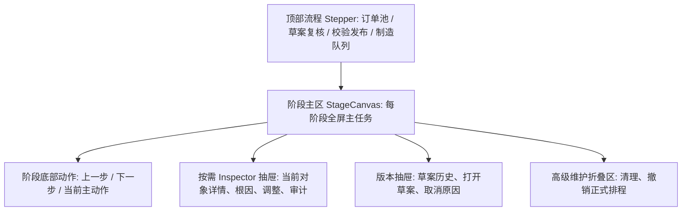

# 排程工作台向导式四阶段改版 Goal 计划

**日期**：2026-05-23
**状态**：已完成实现并通过回归验证
**目标页面**：`/workbench`
**设计方向**：向导式全屏流程，而不是三栏常驻工作台
**落地提交**：`0f37d7d feat: add workbench wizard flow and pagination`

## 1. 背景

当前 `/workbench` 已经具备订单池、订单初筛、预排程草案、草案复核、人工调整、校验发布、制造队列和审计能力，但 UI 信息组织仍然不合理：

- 四阶段 Stepper 可以越级点击，未创建草案时也能进入“草案复核 / 校验发布 / 制造队列”。
- 左侧区域长期是订单池，和当前阶段任务不匹配。
- 主内容虽然按阶段显示不同标题，但仍然容易把订单池、草案、资源甘特、校验、制造队列理解成同一块堆叠页面。
- 右侧 Inspector 长期堆放草案、订单、校验、调整、审计信息，阶段感弱。

本计划采用用户确认的 **B 方案：向导式全屏流程**。核心目标是把工作台变成明确的业务流程：

1. 订单池 / 初筛
2. 草案复核
3. 校验发布
4. 制造队列

每个阶段只服务一个主任务，后续阶段必须由业务状态解锁。

## 2. 总目标

让计划员打开 `/workbench` 后，可以在 5 秒内判断：

- 当前处于哪一个业务阶段。
- 当前阶段可以做什么，不能做什么。
- 下一步主动作是什么。
- 为什么后续阶段被锁定。
- 哪些订单未排、延期、阻断或需要人工复核。
- 草案是否可发布，以及不可发布的明确原因。
- 发布后哪些订单进入制造队列。

## 3. 非目标

- 不修改排程算法、换产规则、机台匹配规则和求解逻辑。
- 不修改现有预排草案生命周期：`DRAFT -> VALIDATED -> CONFIRMED / CANCELLED`。
- 不把订单输入、机台配置、规则配置塞入工作台主流程。
- 不取消人工复核和人工调整能力。
- 不把制造队列扩展成完整 MES。
- 不在本阶段新增复杂权限模型。

## 4. 目标信息架构

关键变化：

- 不再让左侧订单池常驻占位。
- 不再让右侧 Inspector 常驻堆满所有上下文。
- 阶段主区变成全屏工作面。
- Inspector 改成点击订单、校验项、队列项时打开的抽屉。
- 后续阶段未解锁时 Stepper 禁用或展示锁定态，不允许越级进入真实阶段内容。

## 5. 阶段解锁规则

| 阶段 | 解锁条件 | 允许操作 | 锁定时提示 |
| --- | --- | --- | --- |
| 订单池 / 初筛 | 永远可进入 | 搜索、筛选、初筛、选择订单、创建草案 | 无 |
| 草案复核 | 存在 active preplan | 查看未排、延期、阻断、可排未落位、资源视图、人工调整 | 请先从订单池创建预排程草案 |
| 校验发布 | 存在 active preplan，且可触发或已完成校验 | 校验方案、查看发布检查清单、确认发布 | 请先创建草案并完成复核 |
| 制造队列 | 草案已 `CONFIRMED` 或存在 queue rows | 查看队列、推进状态、记录暂停/取消原因 | 草案尚未发布，不能进入制造队列 |

说明：

- 用户可以回看已完成阶段。
- 用户不能越级进入未解锁阶段。
- 点击锁定阶段不改变 `activeStage`，只显示轻量提示或锁定原因。
- 业务动作仍由按钮触发，单纯切换阶段不能修改草案状态。

## 6. P0 Goal：阶段状态机与越级拦截

**目标**：先修正最影响演示可信度的问题：后续阶段不能随意点击，阶段必须由业务状态解锁。

### Task P0.1：定义阶段状态派生模型

- **位置**：`web/src/pages/workbenchViewModel.js`
- **内容**：
  - 新增 `deriveWorkbenchStageStates(...)`。
  - 输出每个阶段的 `status`: `current | done | available | locked`。
  - 输出每个阶段的 `lockReason`。
  - 保留 `deriveWorkflowStep(...)` 作为推荐阶段来源，但不能再单独决定按钮是否可点。
- **验收**：
  - 无草案时，只有订单池 `current/available`，其他阶段 `locked`。
  - 创建草案后，草案复核解锁。
  - 校验后，校验发布解锁。
  - 发布后，制造队列解锁。

### Task P0.2：Stepper 增加锁定态和禁用态

- **位置**：`web/src/pages/ScheduleWorkbench.jsx`
- **内容**：
  - `WorkflowStepper` 接收阶段状态。
  - 锁定阶段按钮禁用或点击只展示锁定原因。
  - `aria-disabled`、`disabled`、`title` 和 `data-testid` 保持可测。
- **验收**：
  - 无草案时不能进入草案复核、校验发布、制造队列。
  - e2e 明确断言后续阶段不可点击。

### Task P0.3：修正现有 e2e 错误预期

- **位置**：`web/e2e/workbench.spec.js`
- **内容**：
  - 删除“无前置条件也能点击后续阶段”的测试预期。
  - 增加锁定态测试。
- **验收**：
  - 测试不再把越级点击当成正确行为。

## 7. P1 Goal：向导式全屏主区

**目标**：让四个阶段的主内容真正不同，页面不再三栏常驻。

### Task P1.1：重构 Workbench Shell

- **位置**：`web/src/pages/ScheduleWorkbench.jsx`、`web/src/index.css`
- **内容**：
  - 移除常驻三栏布局依赖。
  - 新增 `WorkbenchWizardShell` 或等价内部结构。
  - 顶部保留阶段 Stepper。
  - 中间为单一 `StageCanvas`。
  - 底部或阶段头部显示“上一步 / 下一步 / 当前主动作”。
- **验收**：
  - 订单池阶段不显示草案复核表。
  - 草案复核阶段不显示待排订单池常驻栏。
  - 校验发布阶段不显示资源拖拽。
  - 制造队列阶段只显示真实队列或发布前空态。

### Task P1.2：订单池阶段全屏化

- **内容**：
  - 搜索、筛选、初筛汇总、订单选择、创建草案全部在主区完成。
  - 点击订单打开 Inspector 抽屉显示初筛根因和建议。
- **验收**：
  - 无草案进入页面，用户只看到订单池主流程。
  - 创建草案成功后自动进入草案复核。

### Task P1.3：草案复核阶段全屏化

- **内容**：
  - 默认展示订单维度复核表。
  - 默认聚焦“需处理”：阻断、未排、延期、可排未落位。
  - 资源甘特作为阶段内二级视图。
  - 人工调整入口在 Inspector 抽屉中展示。
- **验收**：
  - 创建草案后不默认进入资源视图。
  - 选择订单后能看到根因、证据、建议动作、调整入口。

### Task P1.4：校验发布阶段全屏化

- **内容**：
  - 主区展示发布 checklist。
  - 明确展示草案生命周期、订单快照、策略快照、校验状态、阻断数、警告数、将发布订单数。
  - 不可发布时展示具体原因和下一步。
- **验收**：
  - 用户不用在右侧 Inspector 中寻找“为什么不能发布”。
  - hard error、warning policy、snapshot stale 都有明确提示。

### Task P1.5：制造队列阶段全屏化

- **内容**：
  - 仅发布后展示队列表。
  - 未发布时展示锁定空态和返回校验发布入口。
  - 队列状态推进保留原因必填规则。
- **验收**：
  - 发布成功后自动进入制造队列阶段。
  - `ON_HOLD`、`CANCELLED` 仍必须填写原因。

## 8. P2 Goal：按需 Inspector 抽屉

**目标**：降低主屏信息密度，把根因、调整、审计放到当前对象上下文中。

### Task P2.1：建立 selectedContext 模型

- **位置**：`ScheduleWorkbench.jsx` 或拆分到 `workbenchViewModel.js`
- **内容**：
  - `selectedContext = { type, id, sourceStage }`
  - 支持 `pending_order`、`draft_order`、`validation_item`、`queue_item`。
- **验收**：
  - 不同阶段选择对象不会互相污染。
  - 切换阶段时清理无效上下文。

### Task P2.2：实现 Inspector Drawer

- **内容**：
  - 抽屉从右侧打开。
  - 可关闭。
  - 不挤压主区布局。
  - 移动端全宽覆盖。
- **验收**：
  - 点击订单、校验项、队列项均打开正确内容。
  - 关闭抽屉后主区状态不丢失。

### Task P2.3：迁移根因、人工调整、审计内容

- **内容**：
  - 订单池：初筛根因和建议。
  - 草案复核：订单根因、换产说明、人工调整、调整记录。
  - 校验发布：校验项证据、发布阻断、审计摘要。
  - 制造队列：队列项详情、状态流转、最近原因。
- **验收**：
  - 主区不再堆叠长根因和审计列表。
  - 当前对象详情仍完整可查。

## 9. P3 Goal：视觉、响应式和回归测试

**目标**：让新向导结构适合演示和长期维护。

### Task P3.1：视觉布局整理

- **内容**：
  - Stepper 显示 `done/current/available/locked`。
  - 阶段主区标题明确。
  - 主动作按钮唯一。
  - 空态必须包含原因和下一步。
- **验收**：
  - 1440x900、1280x720、1024x768 无不合理横向滚动。
  - 文案不溢出按钮和卡片。

### Task P3.2：补齐 data-testid

- **内容**：
  - 阶段按钮、锁定原因、主动作、阶段主区、Inspector 抽屉、二级视图、队列动作都要可测。
- **验收**：
  - e2e 不依赖不稳定文本或坐标。

### Task P3.3：完整 e2e 闭环

- **验证场景**：
  - 无草案进入工作台。
  - 搜索、筛选、选择订单。
  - 创建预排草案。
  - 默认进入草案复核。
  - 查看未排/延期/阻断订单根因。
  - 打开资源视图。
  - 发起人工调整并校验失败/成功反馈。
  - 校验发布阶段展示 checklist。
  - 阻断时禁止发布。
  - 可发布时确认进入制造队列。
  - 制造队列状态推进。

## 10. 验收矩阵

| 优先级 | 验收项 | 通过标准 |
| --- | --- | --- |
| P0 | 阶段不能越级 | 无草案时后 3 阶段锁定 |
| P0 | 阶段状态可解释 | 锁定阶段显示具体原因 |
| P1 | 左侧不再常驻不变 | 不同阶段主区完全不同 |
| P1 | 订单池阶段清晰 | 创建草案前只聚焦订单选择 |
| P1 | 草案复核聚焦异常 | 未排、延期、阻断优先展示 |
| P1 | 发布原因清晰 | 不可发布原因在主区可见 |
| P1 | 制造队列真实解锁 | 未发布不显示正式队列表 |
| P2 | Inspector 不堆叠 | 只在选择对象后打开对应抽屉 |
| P3 | 响应式稳定 | 主要视口无布局溢出 |
| P3 | e2e 覆盖闭环 | workbench e2e 全流程通过 |

## 11. 建议提交拆分

1. `feat: gate workbench wizard stages`
   - P0 阶段状态机、Stepper 锁定、e2e 修正。
2. `feat: convert workbench to wizard stages`
   - P1 主区全屏化、四阶段内容拆分。
3. `feat: add workbench inspector drawer`
   - P2 selectedContext 和抽屉迁移。
4. `test: cover workbench wizard flow`
   - P3 e2e、响应式和稳定选择器。

## 12. 风险与控制

| 风险 | 控制 |
| --- | --- |
| `ScheduleWorkbench.jsx` 已经很大，继续堆代码风险高 | 先内部拆组件，再视情况迁移到 `web/src/components/workbench/` |
| UI 改版影响现有 e2e | P0 先修正错误预期，后续每阶段改完立即补测试 |
| Inspector 从常驻变抽屉后信息不易发现 | 阶段主区保留根因摘要，完整证据放抽屉 |
| 人工调整入口被隐藏过深 | 草案复核表行和资源任务点击后，抽屉内固定显示调整入口 |
| 发布逻辑被 UI 改版误伤 | `canConfirm`、`publishBlockReason`、后端 validate/confirm API 不改 |
| 制造队列和草案复核边界混淆 | 未发布只显示锁定空态，发布后才显示队列表 |

## 13. 完成定义

本 goal 完成时必须满足：

- `/workbench` 是向导式四阶段，而不是三栏常驻堆叠。
- 未满足前置条件的阶段不能越级进入。
- 每个阶段主区只呈现当前阶段核心任务。
- 根因、调整、审计通过当前对象 Inspector 抽屉查看。
- 创建草案、复核、校验、发布、制造队列推进形成完整 UI 闭环。
- `npm run lint`、`npm run build`、`npm run e2e -- workbench.spec.js` 通过。
